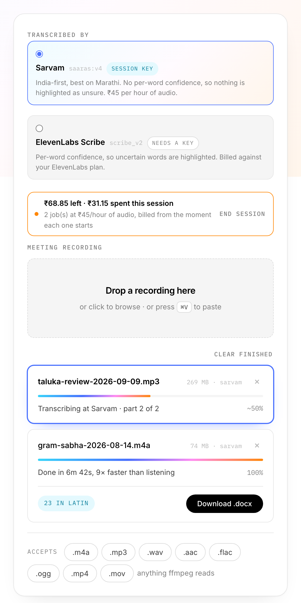
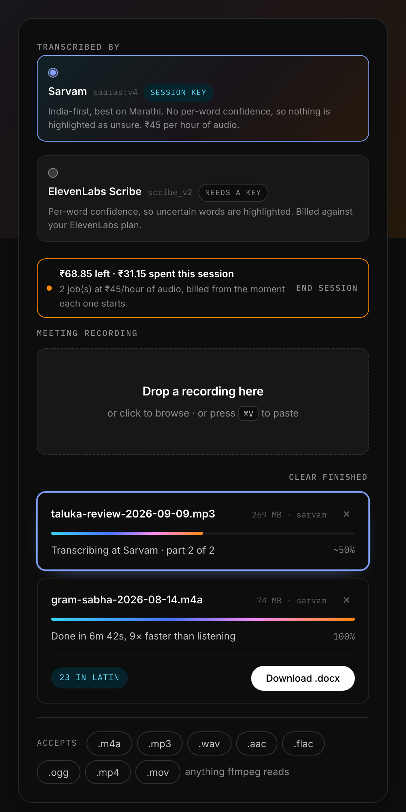
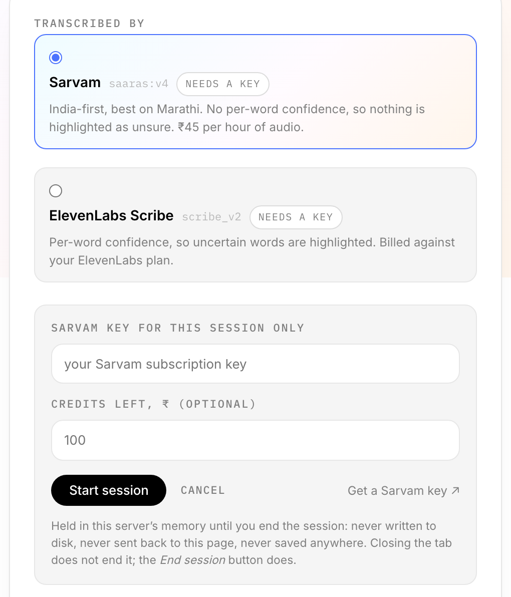
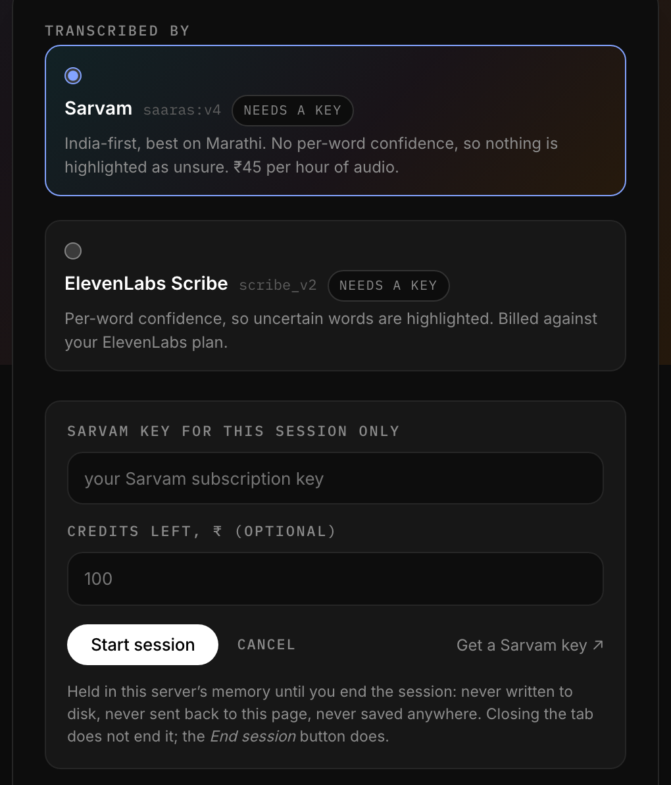

<h1>मराठी Meeting Transcriber</h1>

Marathi meeting audio, with the English code-switching real meetings actually have,
into a Word document you can hand to a reviewer. Every word the model was unsure of is
highlighted and collected into a checklist at the top, so somebody checks the doubts
instead of re-listening to the whole hour.

Drop a file in the browser, get a `.docx`. Bring your own API key; it lives in memory
for the session and nowhere else.

<table>
<tr>
<td width="50%"></td>
<td width="50%"></td>
</tr>
<tr>
<td align="center"><em>Light</em></td>
<td align="center"><em>Dark</em></td>
</tr>
</table>

---

## What it does

| | |
|---|---|
| **Two hosted backends** | Sarvam (`saaras:v4`) and ElevenLabs Scribe (`scribe_v2`), picked per upload from a list, not a dropdown, because each one has a different price, a different privacy answer and a different story about confidence |
| **Bring your own key** | Paste a key on the page. It is verified against the service before any audio moves, then held in server memory for the session: never written to disk, never sent back to the page, never in any status response |
| **Spend meter** | ₹ spent this session, charged the instant the backend starts a job, not when it succeeds, because a run that comes back empty or gets stopped is billed just the same |
| **Auto-split over the cap** | Sarvam takes 2 hours per file. Longer recordings are cut into equal parts, re-encoded, sent one at a time and stitched back onto a single clock. 269 MB becomes 34 MB twice |
| **Estimated progress** | None of these services report progress. The bar is drawn from elapsed time against the length of the recording, shown as `~43%` because it is a guess |
| **Review checklist** | Every flagged word gets a numbered row: timestamp, what was heard, why it is flagged, and a blank Correction column, on its own page, before the transcript |
| **Two kinds of doubt** | Yellow for low confidence, turquoise for an English word left in Latin script instead of Devanagari |
| **Speaker labels** | Diarization from whichever backend is running; paragraphs never merge two voices |
| **Vocabulary hints** | `KEYTERMS` biases the decoder toward village names, scheme acronyms and the people in the room. A bias list, not a prompt |
| **A real queue** | Drop several files; they run one at a time. Stop one, clear the finished ones, reload the tab and reconnect to work already running |
| **No build step** | One HTML file, two stylesheets, no framework, no bundler, no npm |

## What it costs

Sarvam bills **₹30 per hour of audio, ₹45 with speaker labels on** (the default),
counted per second **from the moment a job starts**. A run that fails, comes back
empty, or gets stopped is billed in full. A new account's ₹100 of free credit is
about **2h13m of diarized audio**. ElevenLabs bills against your plan's quota, which
is not a number this can turn into rupees, so there the meter counts jobs instead of
inventing a figure.

Three things spend credit with nothing to show for it, all of them now guarded:

- **A run that comes back empty.** A wrong `Content-Type` makes Sarvam decode the blob
  as WAV and return a blank transcript with the job still marked Success, billed in
  full. `_mime()` reads the real container with ffprobe, because this pipeline's first
  real recording was raw AAC named `.mp3`.
- **Stopping a job.** Sarvam has no cancel endpoint. Once started it runs to completion
  on their side and bills, whatever this end does. Stop only stops the polling.
- **Diarization you do not need.** `SARVAM_DIARIZE=0` on a single-voice recording is a
  third off.

Every run logs the duration and estimated cost *before* it uploads, so the number
arrives before the job does rather than after the balance moves.

## Your audio leaves this machine

Unconditionally: every backend is a hosted API. There used to be a local Whisper
path: 3 GB of weights, a Silero VAD trim, silence-aware chunking, a levelling pass.
It was removed. It was the only reason this needed `numpy`, `mlx`, `onnxruntime`,
`sherpa-onnx` and a GPU, and its Marathi was worse than the API it was competing
with. What is left is an uploader, a poller and a document builder in about 700 lines,
and a virtualenv of 40 MB.

Read the retention policy of whichever service you pick before sending a recording
that matters.

## Setup

`ffmpeg` is required, on `PATH`: it reads the duration of an upload and cuts anything
over a backend's per-file cap into parts. Nothing else is heavy.

```sh
brew install ffmpeg
curl -LsSf https://astral.sh/uv/install.sh | sh
git clone https://github.com/ShantanuTaro/MarathiMeetingTranscriber.git
cd MarathiMeetingTranscriber
uv venv --python 3.12
uv pip install -r requirements.txt
```

No API key is needed to start the server. You give it one on the page.

## Run

```sh
.venv/bin/uvicorn app:app --port 8000    # START: portal at http://localhost:8000
pkill -f "uvicorn app:app"               # STOP:  or Ctrl+C in that terminal
.venv/bin/python test_transcribe.py      # self-check: no audio, no network, no key
```

### Picking a service, and giving it a key

Selecting a service with no key opens its key form directly. This is what a first
visit looks like:

<table>
<tr>
<td width="50%"></td>
<td width="50%"></td>
</tr>
<tr>
<td align="center"><em>Light</em></td>
<td align="center"><em>Dark</em></td>
</tr>
</table>

The key is checked before any audio moves: Sarvam by creating a job and never
starting it (billing begins at `/start`, so this costs nothing), ElevenLabs by reading
the account. It is then held in server memory against a token in the tab's
`sessionStorage`. **One token is one backend**, so a Sarvam key can never ride to
ElevenLabs. `End session` drops it, starting a session for another service drops it,
and so does restarting the server. Closing the tab does not.

`SARVAM_API_KEY` / `ELEVENLABS_API_KEY` in the environment still work and outlive any
session. Use them for the CLI, or for a server you do not want to hand a key to on
every page load.

Each upload goes to whichever service was selected when it was dropped, so a hard
meeting can go to one and the rest to another, in the same queue. The page's claims
follow the selection: the privacy answer, the *How it works* step and the
yellow-highlight legend are rewritten from the service you picked, because "yellow
means the model was unsure" describes a check that never runs on Sarvam.

### Reading the progress bar

None of these services report progress: they take a file and answer when they are
done. Rather than sit at 0% for twenty minutes, the bar is drawn from how long the job
has actually been running against the length of the recording, easing toward 95% and
never arriving. A bar that hits 100% and stays there reads as a hang. It is shown as
`~43%`, with the tilde, because it is a guess. Real progress, which a split job
reports once per finished part, always wins over it. The card being worked on is
highlighted; one job runs at a time.

Stopping the server kills any transcription in flight and forgets every job card,
since jobs live in memory. To stop one recording and keep the server up, use the ×
on its card. **Stopping a job does not stop the backend from billing it.**

### Command line, no server

```sh
export SARVAM_API_KEY=sk_...
.venv/bin/python transcribe.py meeting.m4a
```

## The document

A4, 2.4 cm margins, a Marathi Devanagari face throughout, page numbers in the footer.

1. **Header.** Source file, duration, how much of it was audible speech, model, and
   when it was generated.
2. **Review checklist.** Its own page, before the transcript. One numbered row per
   flagged word:

   | # | TIME | HEARD AS | WHY | CORRECTION |
   |---|---|---|---|---|
   | 1 | 00:08 | agenda | Latin script | |
   | 2 | 00:10 | पाणीपुरवठा | 55% sure | |
   | 3 | 00:15 | घणसावंगी | 48% sure | |

3. **Transcript.** A grey timestamp opens each paragraph, with a speaker label where
   the backend gives one. Backends emit a segment every few seconds, so segments are
   merged until a pause longer than `GAP_SEC` or `PARA_SEC` of unbroken speech;
   otherwise an hour becomes 600 stubby lines.

Two highlights, and they mean different things:

- **Yellow.** Per-word confidence below `CONF_THRESHOLD`. Only ElevenLabs reports
  this. On Sarvam the document *says so* rather than printing "0 words below 60%
  confidence", which reads as a clean bill of health for a check that never ran.
- **Turquoise.** The word came out in Latin script instead of Devanagari. Models
  decide this per word and are not consistent about it. Rather than guess at a
  transliteration (English orthography is not phonetic, so automated attempts mangle
  it), the leftovers are flagged for a human.

## Knobs (env vars)

| Var | Default | Notes |
|---|---|---|
| `ASR` | `sarvam` | or `elevenlabs`. On the server this is only the *default*; the page offers a picker |
| `CONF_THRESHOLD` | `0.60` | higher = more words flagged. No-op on Sarvam, which reports no confidence |
| `DEVANAGARI_FONT` | `ITF Devanagari Marathi` | `Kohinoor Devanagari` is the macOS default face; `Nirmala UI` on Windows |
| `SPEAKERS` | `0` | how many people were in the room, if you know. Clustering guesses worse than you do |
| `KEYTERMS` | *(empty)* | comma-separated vocabulary hints, see below |
| `SARVAM_API_KEY` | *(none)* | optional; the page can take one for the session instead |
| `SARVAM_MODEL` | `saaras:v4` | `saarika:v2.5` is deprecated upstream |
| `SARVAM_LANG` | `mr-IN` | empty = auto-detect |
| `SARVAM_DIARIZE` | `1` | speaker labels. `0` drops the rate from ₹45/hr to ₹30/hr |
| `SARVAM_POLL_SEC` | `10` | how often to ask if the job is done |
| `ELEVENLABS_API_KEY` | *(none)* | optional; the page can take one for the session instead |
| `SCRIBE_MODEL` | `scribe_v2` | `scribe_v1` is deprecated upstream |
| `SCRIBE_LANG` | `mar` | empty = auto-detect. Don't: on code-switched audio it can pick English and translate the lot |

Constants in `transcribe.py`: `SARVAM_MAX_SEC` (7200), `SARVAM_MAX_KEYTERMS` (50),
`MAX_REVIEW_ROWS` (200), `GAP_SEC` (1.5), `PARA_SEC` (30).

## Telling it what the meeting was about

`KEYTERMS` biases the decoder toward spellings it cannot get from the audio: village
names, scheme acronyms, the people in the room. It is a **bias list, not a prompt**:
each term nudges scoring where it sounds close, and costs nothing when it never comes
up.

```sh
export KEYTERMS='घणसावंगी, जाफराबाद, आरडीएसएस, एनडीआरएफ, पीएचसी, डीबीटी'
.venv/bin/python transcribe.py meeting.m4a
```

Terms may contain spaces, not commas. Order matters past the cap. `saaras:v4` takes
50 and the rest are dropped, so put the words it currently gets wrong first. On
`ASR=elevenlabs` the same variable maps to Scribe's `keyterms` (cap 1000, and it bills
+20% whenever it is set).

**Where to get the terms.** Run the meeting once with no hints, then read the
transcript for names that came out two different ways: on the first hour-long run, the
same taluka appeared as both घणसावंगी and धनसागवी, and one scheme as both आरडीएस and
आरडीएसएस. Those inconsistencies are exactly the close calls a keyterm settles. Names
of people in the room are worth adding blind: a model has no way to guess them, and
they are the words a reader most notices being wrong.

Untested against the live API: the account ran out of credits before this could be
measured. The parameter is accepted at job creation; whether it helps your audio is
still yours to measure.

## Files over two hours

Sarvam caps one file at **2 hours**. A longer recording is cut into as few equal parts
as that allows (2h18m becomes two of 1h09m, not a 2h part and an 18m stub), sent one
at a time, and stitched back onto a single clock so the document reads as one meeting.
The parts are re-encoded to 64k mono AAC on the way out, which is the difference
between uploading 269 MB and uploading 34 MB twice, and means one container works
whatever codec came in.

Two things to know about a split job:

- **Speaker ids are clustered per job**, so `Speaker 1` in part two is not who it was
  in part one. The parts are renumbered rather than merged, because one label meaning
  two people is worse than a document with too many speakers.
- **The cut lands on the clock, not on a silence**, so one word at each seam may be
  damaged. Finding a quiet frame would mean decoding the whole file first.

ElevenLabs has no equivalent split. Its cap is far higher and nothing here has hit it;
if you do, that is the place to add one.

## Backend notes

**Sarvam.** India-first, and on the test clip it did the thing Whisper would not:
English terms came back transliterated into Devanagari rather than left in Latin
script (`agenda` → `अजेंडा`, `budget review` → `बजेट रिव्ह्यू`), which is most of what
the turquoise highlight exists to catch. What you give up is the yellow highlights:
it reports no per-word confidence at all, so `CONF_THRESHOLD` is a no-op and the
checklist can only ever list Latin-script words. Timestamps are per sentence, so each
review row's time is interpolated across its sentence: right to the minute, not the
second. Its synchronous endpoint caps at 30 seconds, which is why this uses the batch
job API even for short clips: create job, PUT to a presigned Azure URL, start, poll,
download. The audio does not pass through Sarvam on the way in.

**ElevenLabs Scribe.** The only backend that returns both things this document was
designed around (per-word timings *and* a per-word logprob), so the yellow highlights
and the checklist mean something. It diarizes itself. Weaker Marathi than Sarvam, most
likely; the trade is confidence data for accuracy. `CONF_THRESHOLD` is worth
re-tuning here: it was set against Whisper's probabilities, and Scribe's
`exp(logprob)` is a different distribution. Measure it on one real meeting or you
will get either every word flagged or none.

## Layout

```
app.py               FastAPI portal: jobs, sessions, the queue
transcribe.py        upload → poll → segments → .docx  (also a CLI)
test_transcribe.py   self-check, no audio and no network
static/index.html    the whole front end, one file
static/portal.css    portal components; style.css is the shared design system
```

Screenshots are captured headlessly from the real page with sample data; see
`docs/`. The recording names and figures in them are invented; no meeting content is
published in this repo.

## License

[MIT](LICENSE). The bundled typefaces are not covered by it and carry their own.
Inter and IBM Plex Mono are both SIL Open Font License 1.1, included alongside the
font files in `static/fonts/`.
